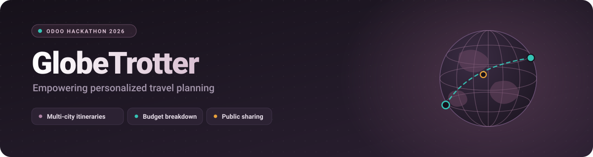
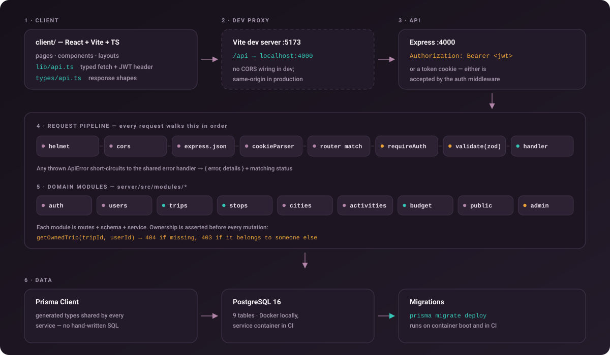
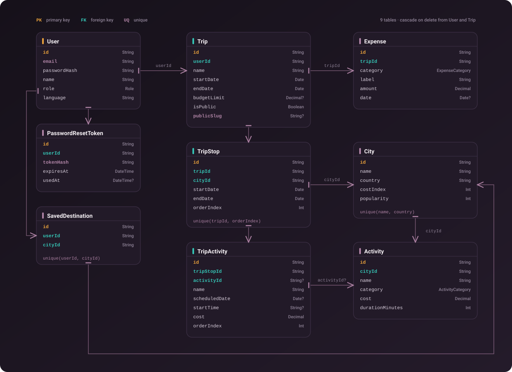
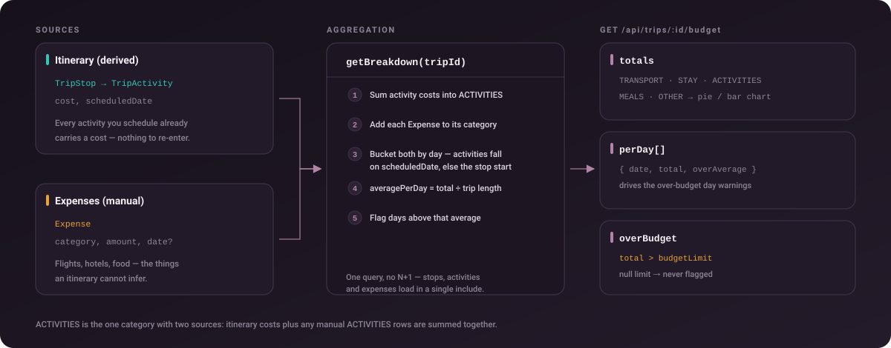
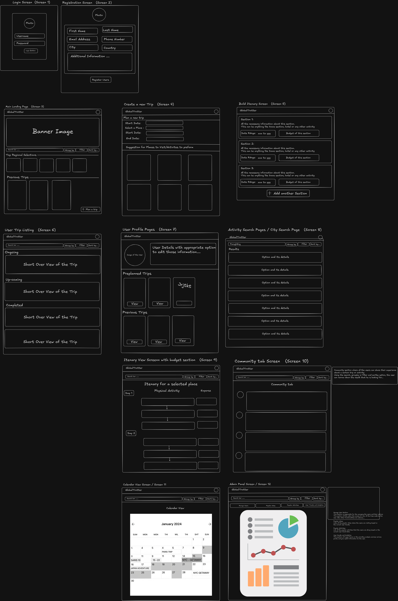
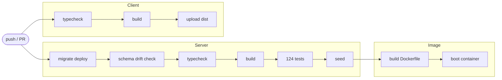

<p align="center">
  
</p>

<p align="center">
  <a href="https://github.com/VedGoyaniTech/globaltrotter-odoo/actions/workflows/ci.yml">
    
  </a>
  
  
  
  
  
</p>

<p align="center">
  <b>Plan a multi-city trip end to end</b> — build a day-wise itinerary, discover cities and
  activities, watch the budget assemble itself, and publish the whole thing on a public link
  anyone can copy.
</p>

---

## What it does

|     | Capability                    | How it works                                                                                                                                 |
| :-: | ----------------------------- | -------------------------------------------------------------------------------------------------------------------------------------------- |
| 🗺️  | **Multi-city itineraries**    | A trip is an ordered list of stops; each stop is a city with its own date range and activities. Reordering is a single transactional call.   |
| 🔎  | **City & activity discovery** | Searchable catalogue with country/region filters, a cost index, and activity filters by category, price and duration.                        |
| 💸  | **Automatic budgeting**       | Costs come from the itinerary itself. Add flights and hotels manually and you get category totals, a per-day curve and over-budget warnings. |
| 📅  | **Timeline & calendar**       | One endpoint flattens the whole trip into one entry per calendar day, city attached.                                                         |
| 🌍  | **Public sharing**            | Flip a switch, get a slug. Anyone can read it; a signed-in visitor can deep-copy it into their own account.                                  |
| 📊  | **Admin analytics**           | Platform counts, most-visited cities, most-used activities.                                                                                  |

---

## Quick start

```bash
git clone https://github.com/VedGoyaniTech/globaltrotter-odoo.git globetrotter
cd globetrotter

npm install                       # npm workspaces — installs client + server
npm run db:up                     # Postgres 16 in Docker

cp server/.env.example server/.env
openssl rand -base64 48           # paste into JWT_SECRET

npm run db:migrate                # create the schema
npm run db:seed                   # 16 cities, 33 activities, 1 demo trip

npm run dev:server                # http://localhost:4000/api
npm run dev:client                # http://localhost:5173
```

Seed accounts — password `Password123`:

| Email                    | Role    | Notes                                        |
| ------------------------ | ------- | -------------------------------------------- |
| `demo@globetrotter.app`  | `USER`  | Owns a fully populated, publicly shared trip |
| `admin@globetrotter.app` | `ADMIN` | Can reach `/api/admin/*`                     |

Vite proxies `/api` → `localhost:4000`, so the frontend never deals with CORS in development.

### Full stack with Docker Compose

Run PostgreSQL, the production-style Express backend, and the hot-reloading Vite frontend
with one command:

```bash
docker compose up --build
```

Open the frontend at `http://localhost:5173`; the API and health endpoint are available at
`http://localhost:4000/api` and `http://localhost:4000/api/health`. Compose waits for the
database and backend health checks before starting their dependants. Frontend source under
`client/` is bind-mounted into its container, so edits refresh in the browser without an
image rebuild. Set a non-demo JWT secret when needed:

```bash
JWT_SECRET="$(openssl rand -base64 48)" docker compose up --build
```

Uploaded avatars and trip covers persist in the `uploads_data` volume; PostgreSQL data uses
`db_data`. Stop the stack with `docker compose down` (add `-v` only when you intentionally
want to delete both volumes).

---

## Architecture



Every route is `routes → schema → service`. Validation is a zod schema per endpoint that
**replaces** `req.body`/`req.query` with the parsed result, so handlers only ever see typed,
trusted data. Every mutation runs `getOwnedTrip()` first — `404` if the trip doesn't exist,
`403` if it belongs to someone else — which is why there is no way to reach another user's
itinerary through a nested route.

---

## Data model



Three details worth knowing:

- **`unique(tripId, orderIndex)`** keeps stop order honest. Reordering therefore runs in a
  transaction that first parks every row at a negative index, then writes the final ones —
  otherwise a mid-update collision would reject the whole reorder.
- **`TripActivity.activityId` is nullable.** Pick something from the catalogue and its name,
  cost and duration are copied in; type your own and it lives as a free-form row on the stop.
  Either way the trip keeps working if the catalogue entry is later deleted.
- **Deletes cascade** from `User` and from `Trip`, so account deletion is a single statement
  and never leaves orphans.

---

## How the budget is computed



---

## Screens → API

The 12 wireframed screens and the endpoints that back them.

|   # | Screen                 | Endpoints                                                                                    |
| --: | ---------------------- | -------------------------------------------------------------------------------------------- |
|   1 | Login                  | `POST /auth/login` · `POST /auth/forgot-password` · `POST /auth/reset-password`              |
|   2 | Registration           | `POST /auth/signup` · `POST /users/me/avatar`                                                |
|   3 | Main landing           | `GET /trips?filter=upcoming` · `GET /cities?sort=popularity`                                 |
|   4 | Create a new trip      | `POST /trips` · `GET /cities` · `GET /activities`                                            |
|   5 | Build itinerary        | `POST /trips/:id/stops` · `PUT /trips/:id/stops/reorder` · `POST …/stops/:stopId/activities` |
|   6 | User trip listing      | `GET /trips?filter=all\|upcoming\|ongoing\|past`                                             |
|   7 | User profile           | `GET /auth/me` · `PATCH /users/me` · `GET /users/me/saved-destinations`                      |
|   8 | Activity / city search | `GET /activities?q&category&maxCost` · `GET /cities?q&country`                               |
|   9 | Itinerary + budget     | `GET /trips/:id` · `GET /trips/:id/budget`                                                   |
|  10 | Community tab          | `GET /public/trips?q&country&sort` · `GET /public/countries`                                 |
|  11 | Calendar view          | `GET /trips/:id/timeline` · `PUT …/activities/reorder`                                       |
|  12 | Admin panel            | `GET /admin/stats` · `GET /admin/users` · `GET /admin/trips`                                 |

Full request/response reference: **[`server/README.md`](server/README.md)**

---

## Design reference



Editable source: **[Excalidraw](https://link.excalidraw.com/l/65VNwvy7c4X/6CzbTgEeSr1)** ·
problem statement `docs/GlobeTrotter.pdf` (kept local, not tracked)

---

## Tests

```bash
npm run db:up          # tests need Postgres
npm test -w server     # 124 integration tests
```

Not unit tests with mocks — every case drives the real Express app through `supertest` against
a real `globetrotter_test` database. Migrations apply once per run, and every table is
truncated between cases, so tests are order-independent and your dev data is never touched.

<details>
<summary><b>What's covered</b></summary>

- **Auth** — signup normalisation, first/last name derivation, duplicate `409`, identical
  `401` for wrong-password and unknown-email (no account enumeration), single-use and
  expiring reset tokens, rate-limit budgets
- **Community feed** — published-only listing, search across trip name _and_ itinerary
  cities, country filter, pagination, disappearing from the feed when unshared
- **Uploads** — generated filenames, mimetype rejection, static round-trip, ownership
- **Authorization** — a stranger's `403` on every nested trip route: stops, activities, expenses
- **Ordering** — reversing stops without tripping `unique(tripId, orderIndex)`, reordering
  activities within a stop, rejecting partial or foreign id lists
- **Budget** — category maths, the two-source `ACTIVITIES` total, per-day bucketing,
  `overBudget` boundary at exactly the limit
- **Sharing** — anonymous read, `404` once sharing is off, deep copy independence
- **Validation** — inverted date ranges, bad enums, negative amounts, malformed `HH:mm`

</details>

---

## CI



The **schema drift check** is the interesting one: it fails the build if `schema.prisma` no
longer matches the committed migrations — i.e. somebody edited the model without generating
one. Tests run against a Postgres service container, so CI exercises the same SQL you do.

---

## Deployment

```bash
docker build -f server/Dockerfile -t globetrotter-server .
docker run -p 4000:4000 \
  -e DATABASE_URL="postgresql://…" \
  -e JWT_SECRET="…" \
  globetrotter-server
```

Multi-stage build, runs as the non-root `node` user, and applies pending migrations on boot so
a fresh environment provisions itself. `NODE_ENV=production` is baked in — keep it that way,
since the reset-token debug field is only suppressed in production.

---

## Repo layout

```
globetrotter/
├── client/                    React + Vite + TS  ·  design track
│   └── src/
│       ├── pages/  components/  layouts/  hooks/
│       ├── lib/api.ts         typed fetch wrapper + token storage
│       └── types/api.ts       server response shapes
│
├── server/                    Express + TS      ·  backend track
│   ├── prisma/
│   │   ├── migrations/        committed, verified by CI
│   │   ├── schema.prisma
│   │   └── seed.ts
│   ├── src/
│   │   ├── config/env.ts      zod-validated environment
│   │   ├── lib/               prisma · jwt · password · errors
│   │   ├── middleware/        auth · validate · error
│   │   ├── modules/           auth users trips stops cities
│   │   │                      activities budget share admin
│   │   └── routes/
│   ├── tests/                 vitest + supertest
│   └── Dockerfile
│
├── docs/assets/               diagrams
└── docker-compose.yml
```

---

## Who owns what

| Track             | Owns                                                                   | Agent                      |
| ----------------- | ---------------------------------------------------------------------- | -------------------------- |
| Backend           | `server/**`, `docker-compose.yml`, `.github/**`                        | Claude                     |
| Frontend & design | `client/src/{pages,components,layouts,styles,hooks}`                   | Codex                      |
| Shared contract   | `client/src/types/api.ts`, `client/src/lib/api.ts`, `server/README.md` | coordinate before changing |

Separate branches, merged by PR. Details in [`AGENTS.md`](AGENTS.md).

> **Note for the UI track:** Prisma `Decimal` columns serialise as JSON **strings** —
> `cost: "20"`, not `20`. `client/src/types/api.ts` reflects this; remember to `Number()`
> before arithmetic.

---

## Roadmap

**Done since the first scaffold**

Second pass — a line-by-line audit of the PDF's "Key Functionality/Components" turned up
four requirements with no endpoint behind them. All four are now built:

- **Editable email** (feature 12 lists name, photo *and* email). `PATCH /users/me/email`
  re-authenticates with the current password, rejects addresses already in use, and
  invalidates reset links sent to the old address.
- **Admin user management tools** (feature 13). Promote, demote and delete travellers,
  with guards so an admin cannot change or delete their own account and the last
  remaining admin cannot be removed. `/admin/stats` also gained an engagement block.
- **Dashboard budget highlights** (feature 2). `GET /trips/summary` returns trip counts,
  the next departure and category totals for money still ahead — one query, not one per trip.
- **Recommended destinations** (feature 2). `GET /cities/recommended` ranks by popularity
  and, for a signed-in traveller, skips cities they have already saved or planned.

Plus activity descriptions in the seed, for feature 8's "quick view of description".

**First pass**

- Community feed — `GET /public/trips` with search across trip names _and_ itinerary
  cities, country filter, sort and pagination, plus `GET /public/countries`
- Registration fields — `firstName`, `lastName`, `phone`, `bio`; signup takes either a
  display name or a first/last pair
- Per-stop budget on `TripStop`, for the section budgets in the itinerary builder
- `ongoing` trip filter, with the three buckets now disjoint
- Bulk activity reorder within a stop
- Image upload for avatars and trip covers — random filenames, mimetype allow-list, size
  cap, old file cleaned up on replace
- Rate limiting on auth and password-reset routes, with `TRUST_PROXY` so the client IP is
  read correctly behind a proxy
- Admin lists paginated; spent reset tokens pruned on the next request

**Still open**

- Social-media share cards (feature 11) would need server-rendered Open Graph tags; the
  SPA cannot produce them and a link preview is the only part not covered
- Activity and city images are still `null` in the seed — the schema holds the URLs, but
  the frontend supplies its own fallbacks
- Password reset delivers no email — the token comes back in the response outside
  production. Needs a mail provider before this ships.
- Uploads go to local disk. Fine for a demo behind one container with a volume; object
  storage is the real answer for more than one instance.
- No ESLint or Prettier — typecheck is doing that work.
- CI builds the production image but nothing deploys it.
- `react-router-dom` has a moderate open-redirect advisory; the fix is a v7 major bump,
  which is the design track's call.
